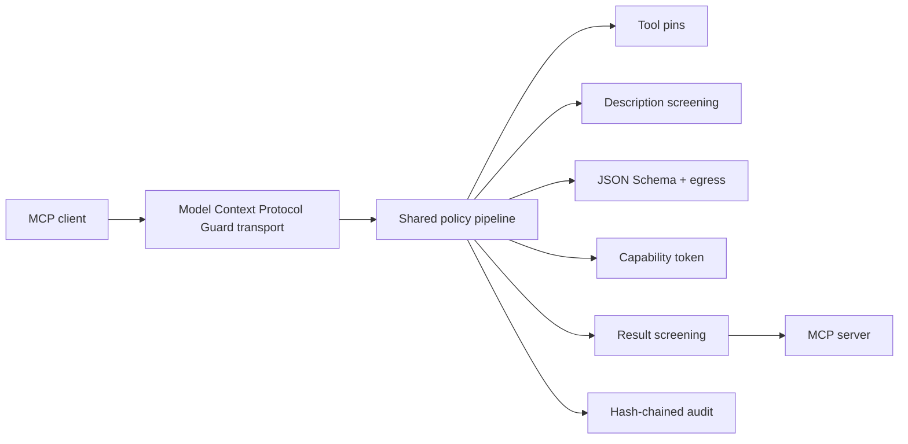

# Model Context Protocol Guard

Model Context Protocol Guard is a transparent, deny-by-default security proxy between an MCP client and MCP servers. It pins tool definitions, screens tool descriptions and results, validates call arguments, enforces egress policy, checks attenuable HMAC capability tokens, and writes an append-only audit log.

## Quickstart

```powershell
py -3.12 -m venv .venv
.\.venv\Scripts\python -m pip install -e ".[dev]"
model-context-protocol-guard stdio -- python -m your_mcp_server
```

Example `mcp.json`:

```json
{
  "mcpServers": {
    "files-guarded": {
      "command": "model-context-protocol-guard",
      "args": ["stdio", "--server-name", "files", "--", "python", "-m", "files_server"]
    }
  }
}
```

Run the same gate on Windows and in the Linux container.

## Architecture



## Results

<!-- RESULTS:START -->
| Metric | Value | 95% CI |
|---|---:|---:|
| stdio e2e tools/call pooled overhead p95 | 0.443 ms | [0.415, 0.472] |
| HTTP e2e tools/call pooled overhead p95 | 0.595 ms | [0.555, 0.628] |
| held-out MCP corpus detection | 1.000 | [0.983, 1.000] |
| held-out MCP corpus false positives | 0.000 | [0.000, 0.017] |
| token verify mean | 0.0561 ms | [0.0516, 0.0606] |
| pipeline-only stdio tools/call p95 | 0.015 ms | [0.013, 0.018] |
| pipeline-only HTTP tools/call p95 | 0.005 ms | [0.005, 0.006] |
| Zero Trust Agent Benchmark v4 test block rate | 0.910 | [0.882, 0.932] |
| Zero Trust Agent Benchmark v4 test false positives | 0.160 | [0.130, 0.195] |
| Zero Trust Agent Benchmark v4 test leak rate | 0.000 | [0.000, 0.004] |
| Zero Trust Agent Benchmark v4 in-policy block rate | 0.820 | [0.768, 0.863] |
| Zero Trust Agent Benchmark v4 in-policy FPR (shared benign set) | 0.160 | [0.130, 0.195] |
| Zero Trust Agent Benchmark v4 in-policy leak rate | 0.000 | [0.000, 0.015] |
| Zero Trust Agent Benchmark v4 out-of-policy block rate | 1.000 | [0.985, 1.000] |
| Zero Trust Agent Benchmark v4 out-of-policy FPR (shared benign set) | 0.160 | [0.130, 0.195] |
| Zero Trust Agent Benchmark v4 out-of-policy leak rate | 0.000 | [0.000, 0.015] |
<!-- RESULTS:END -->

## Development

```bash
bash scripts/check.sh
python bench/run_benchmarks.py --trials 100
```

CI badge placeholders will be enabled after publishing to `github.com/model-context-protocol-guard/model-context-protocol-guard`.
