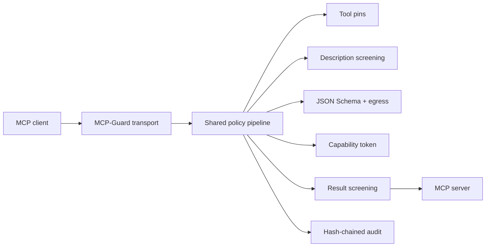

# MCP-Guard

MCP-Guard is a transparent, deny-by-default security proxy between an MCP client and MCP servers. It pins tool definitions, screens tool descriptions and results, validates call arguments, enforces egress policy, checks attenuable HMAC capability tokens, and writes an append-only audit log.

## Quickstart

```powershell
py -3.12 -m venv .venv
.\.venv\Scripts\python -m pip install -e ".[dev]"
mcp-guard stdio -- python -m your_mcp_server
```

Example `mcp.json`:

```json
{
  "mcpServers": {
    "files-guarded": {
      "command": "mcp-guard",
      "args": ["stdio", "--server-name", "files", "--", "python", "-m", "files_server"]
    }
  }
}
```

Linux container check uses the project wheelhouse; Windows native check uses `.venv` and the same `scripts/check.sh` gate.

## Architecture



## Results

<!-- RESULTS:START -->
| Metric | Value | 95% CI |
|---|---:|---:|
| stdio tools/call added p95 | 0.010 ms | [0.008, 0.015] |
| HTTP tools/call added p95 | 0.004 ms | [0.004, 0.005] |
| MCP corpus detection | 1.000 | [0.983, 1.000] |
| MCP corpus false positives | 0.000 | [0.000, 0.017] |
| token verify mean | 0.0311 ms | [0.0273, 0.0349] |
<!-- RESULTS:END -->

## Development

```bash
bash scripts/check.sh
python bench/run_benchmarks.py --trials 100
```

CI badge placeholders will be enabled after publishing to `github.com/mcp-guard-dev/mcp-guard`.
