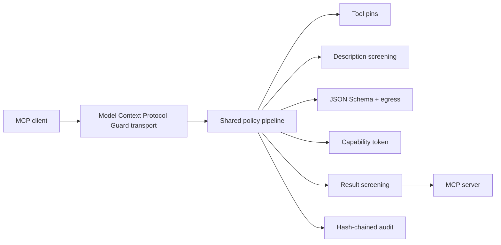

# Model Context Protocol Guard

Model Context Protocol Guard is a transparent, deny-by-default security proxy between an MCP client and MCP servers. It pins tool definitions, screens tool descriptions and results, validates call arguments, enforces egress policy, checks attenuable HMAC capability tokens, and writes an append-only audit log.

## Quickstart

```powershell
py -3.12 -m venv .venv
.\.venv\Scripts\python -m pip install -e ".[dev]"
model-context-protocol-guard stdio -- python -m your_mcp_server
```

Example `mcp.json`:

```json
{
  "mcpServers": {
    "files-guarded": {
      "command": "model-context-protocol-guard",
      "args": ["stdio", "--server-name", "files", "--", "python", "-m", "files_server"]
    }
  }
}
```

Linux container check uses the project wheelhouse; Windows native check uses `.venv` and the same `scripts/check.sh` gate.

## Architecture



## Results

<!-- RESULTS:START -->
| Metric | Value | 95% CI |
|---|---:|---:|
| stdio e2e tools/call overhead p95 | 20.194 ms | [2.442, 58.200] |
| HTTP e2e tools/call overhead p95 | 2.707 ms | [0.667, 4.461] |
| held-out MCP corpus detection | 1.000 | [0.983, 1.000] |
| held-out MCP corpus false positives | 0.000 | [0.000, 0.017] |
| token verify mean | 0.0478 ms | [0.0406, 0.0549] |
| pipeline-only stdio tools/call p95 | 0.014 ms | [0.012, 0.028] |
| pipeline-only HTTP tools/call p95 | 0.005 ms | [0.004, 0.008] |
| Zero Trust Agent Benchmark test block rate | 0.956 | [0.934, 0.971] |
| Zero Trust Agent Benchmark test false positives | 0.028 | [0.017, 0.046] |
| Zero Trust Agent Benchmark test leak rate | 0.001 | [0.000, 0.006] |
| Zero Trust Agent Benchmark in-policy block rate | 0.916 | [0.875, 0.944] |
| Zero Trust Agent Benchmark in-policy leak rate | 0.004 | [0.001, 0.022] |
| Zero Trust Agent Benchmark out-of-policy block rate | 0.996 | [0.978, 0.999] |
| Zero Trust Agent Benchmark out-of-policy leak rate | 0.000 | [0.000, 0.015] |
<!-- RESULTS:END -->

## Development

```bash
bash scripts/check.sh
python bench/run_benchmarks.py --trials 100
```

CI badge placeholders will be enabled after publishing to `github.com/model-context-protocol-guard/model-context-protocol-guard`.
