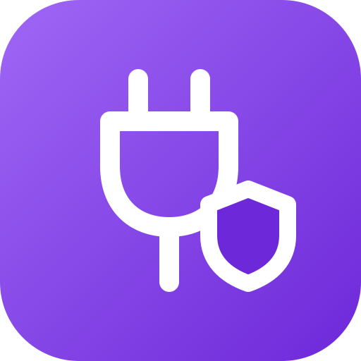
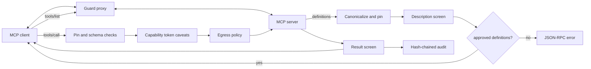
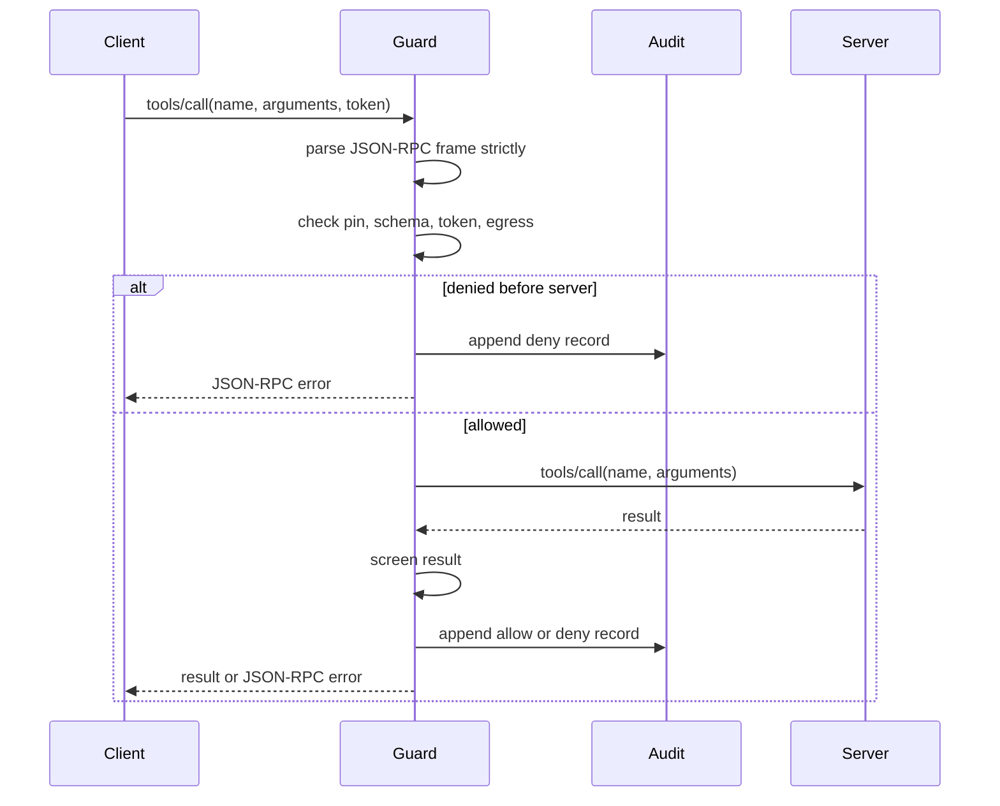

<p align="center"></p>

# Model Context Protocol Guard

[](https://github.com/model-context-protocol-guard/model-context-protocol-guard/actions/workflows/ci.yml)
[](https://github.com/model-context-protocol-guard/model-context-protocol-guard/actions/workflows/formal.yml)
[](https://github.com/model-context-protocol-guard/model-context-protocol-guard/actions/workflows/security.yml)

Model Context Protocol Guard is a deny-by-default proxy between Model Context Protocol (MCP) clients and servers. It supports standard input/output (stdio) and Streamable Hypertext Transfer Protocol (HTTP) paths, pins tool definitions, validates calls, checks attenuated capability tokens, controls egress, screens results, and writes a hash-chained audit log.

## Why I built this

MCP tools are code-shaped authority described in text. A client may approve a tool after reading its name, description, schema, and annotations, then keep using it across sessions. If a server later changes that definition, a client can call a different tool than the one it approved.

I wanted a small guardrail that sits between the client and server. The guard treats every server as untrusted until its current tool definitions are pinned and every call passes the same checks.

## How it works

The proxy has one policy pipeline. The stdio transport frames JavaScript Object Notation Remote Procedure Call (JSON-RPC) on stdin/stdout. The Streamable HTTP path handles POST and Server-Sent Events (SSE) through the same pipeline before forwarding to an upstream handler.



A `tools/list` response is canonicalized and compared with the pin store. A changed definition is denied until it is reviewed and pinned again. A `tools/call` must match the pinned schema, carry an optional hash-based message authentication code (HMAC) capability token whose caveats only narrow authority, pass Uniform Resource Locator (URL) and host egress checks, and return content that does not contain control-token or credential-shaped output.



The Temporal Logic of Actions (TLA+) model in `specs/PinnedTools.tla` checks that changed tool definitions are not forwarded and that attenuation cannot widen call authority. The recorded TLA+ model checker (TLC) run explored 18,317,178 generated states, 1,131,966 distinct states, depth 25, with no error.

## Quickstart

Linux and macOS:

```bash
python3.12 -m venv .venv
. .venv/bin/activate
python -m pip install -e ".[dev]"
model-context-protocol-guard stdio --server-name files -- python -m files_server
bash scripts/check.sh
```

Windows PowerShell:

```powershell
py -3.12 -m venv .venv
.\.venv\Scripts\Activate.ps1
python -m pip install -e ".[dev]"
model-context-protocol-guard stdio --server-name files -- python -m files_server
bash scripts/check.sh
```

Copy-paste `mcp.json` example for a stdio MCP server:

```json
{
  "mcpServers": {
    "files-guarded": {
      "command": "model-context-protocol-guard",
      "args": [
        "stdio",
        "--server-name",
        "files",
        "--pin-file",
        ".model-context-protocol-guard-pins.json",
        "--",
        "python",
        "-m",
        "files_server"
      ]
    }
  }
}
```

## What I measured

The reference run used Python 3.12 on an Arm64 workstation, 5 independent latency sessions, and 200 warm `tools/call` samples per session. Rates use Wilson intervals over distinct traces. Latency intervals use bootstrap quantile intervals or t intervals as recorded in `results/20260926T162528Z-reference/summary.json`. The shared benchmark data was `zero-trust-agent-benchmark-dataset-v4.1`; `test.jsonl` sha256 was `d065bab9bed145490579cd7add6a574c6e23c21c0ea4525dc1c14b0fc15acd2b`.

<!-- RESULTS:START -->
| Metric | Value | 95% confidence interval |
|---|---:|---:|
| stdio end-to-end tools/call pooled overhead 95th percentile | 0.460 ms | [0.416, 0.492] |
| HTTP end-to-end tools/call pooled overhead 95th percentile | 0.429 ms | [0.389, 0.506] |
| held-out Model Context Protocol corpus detection | 1.000 | [0.983, 1.000] |
| held-out Model Context Protocol corpus false positives | 0.000 | [0.000, 0.017] |
| token verification mean | 0.0397 ms | [0.0272, 0.0522] |
| pipeline-only stdio tools/call 95th percentile | 0.009 ms | [0.007, 0.011] |
| pipeline-only HTTP tools/call 95th percentile | 0.004 ms | [0.004, 0.004] |
| Zero Trust Agent Benchmark v4.1 test block rate | 1.000 | [0.992, 1.000] |
| Zero Trust Agent Benchmark v4.1 test false positive rate | 0.012 | [0.006, 0.026] |
| Zero Trust Agent Benchmark v4.1 test leak rate | 0.000 | [0.000, 0.004] |
| Zero Trust Agent Benchmark v4.1 in-policy block rate | 1.000 | [0.985, 1.000] |
| Zero Trust Agent Benchmark v4.1 in-policy false positive rate (shared benign set) | 0.012 | [0.006, 0.026] |
| Zero Trust Agent Benchmark v4.1 in-policy leak rate | 0.000 | [0.000, 0.015] |
| Zero Trust Agent Benchmark v4.1 out-of-policy block rate | 1.000 | [0.985, 1.000] |
| Zero Trust Agent Benchmark v4.1 out-of-policy false positive rate (shared benign set) | 0.012 | [0.006, 0.026] |
| Zero Trust Agent Benchmark v4.1 out-of-policy leak rate | 0.000 | [0.000, 0.015] |
<!-- RESULTS:END -->

| Claim | Target | Result | Outcome |
|---|---|---:|---|
| Pooled stdio guard overhead stays below 5 ms at the 95th percentile | Upper 95% confidence interval <= 5 ms | 0.460 ms, upper 0.492 ms | Met |
| Single Linux container latency run | Upper 95% confidence interval <= 5 ms | 4.243 ms, upper 5.474 ms | Not met |
| Held-out description corpus catches poisoned tool descriptions | Detection lower bound >= 0.95 and false positive rate upper bound <= 0.02 | 1.000 detection, 0.000 false positive rate | Met |
| Changed tool definitions are detected | 100 of 100 changes | 100 of 100 | Met |
| Hash-based message authentication code token verification is below 0.5 ms mean | Mean <= 0.5 ms | 0.0397 ms | Met |
| Shared benchmark v4 profile | Report block rate, in-policy block rate, false positive rate, and leaks | 100.0% block, 100.0% in-policy block, 1.2% false positive rate, 0 leaks | Met by point estimate; false-positive Wilson upper bound is 2.6% |

The Linux container run is kept because it caught a noisy single-session upper bound above 5 ms. I use the 5-session pooled run for the latency claim, not the single container run.

## Benchmark defense ablation

| Version | Test block rate | Test false positive rate | Test leak rate | Official evaluator p95 latency |
|---|---:|---:|---:|---:|
| Version 1 public baseline | 0.910 [0.882, 0.932] | 0.160 [0.130, 0.195] | 0.000 [0.000, 0.004] | 0.138 ms [0.131, 0.146] |
| Final design iteration: structural context checks, requester authority, canonical payload handling, safe scope bridge | 1.000 [0.992, 1.000] | 0.012 [0.006, 0.026] | 0.000 [0.000, 0.004] | 0.284 ms [0.248, 0.336] |

Only one post-baseline design iteration was evaluated on the test split; individual controls were tuned on dev and are grouped to preserve the test split budget.

## Limitations

- First approval is a trust decision. The guard detects later changes, not whether the first version was useful.
- The stdio wrapper is the main command-line interface path. Streamable HTTP support is exposed as an application factory and demo server.
- DNS resolution and network routing can change after policy checks. Use network controls for stronger egress boundaries.
- Result screening uses deterministic patterns. It can miss novel encodings and can block benign hard negatives.
- The benchmark v4 false-positive point estimate is 1.2%. Its Wilson 95% upper bound is 2.6%, so a stronger claim that the upper bound is at most 2% is not supported by this sample size.

## License and citation

Apache-2.0. Use `CITATION.cff` for software citation metadata.
