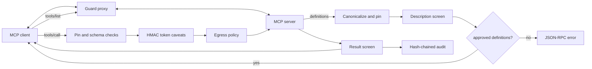
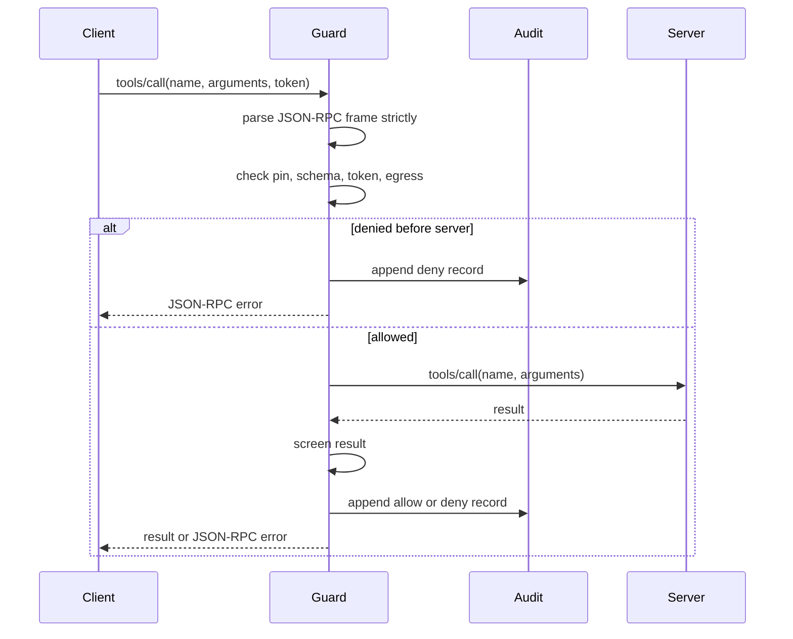

# Model Context Protocol Guard

[](https://github.com/model-context-protocol-guard/model-context-protocol-guard/actions/workflows/ci.yml)
[](https://github.com/model-context-protocol-guard/model-context-protocol-guard/actions/workflows/formal.yml)
[](https://github.com/model-context-protocol-guard/model-context-protocol-guard/actions/workflows/security.yml)

Model Context Protocol Guard is a deny-by-default proxy between MCP clients and MCP servers. It supports stdio and Streamable HTTP paths, pins tool definitions, validates calls, checks attenuated capability tokens, controls egress, screens results, and writes a hash-chained audit log.

## Why I built this

MCP tools are code-shaped authority described in text. A client may approve a tool after reading its name, description, schema, and annotations, then keep using it across sessions. If a server later changes that definition, a client can call a different tool than the one it approved.

I wanted a small guardrail that sits between the client and server. The guard treats every server as untrusted until its current tool definitions are pinned and every call passes the same checks.

## How it works

The proxy has one policy pipeline. The stdio transport frames JSON-RPC on stdin/stdout. The Streamable HTTP path uses the same pipeline before forwarding to an upstream handler.



A `tools/list` response is canonicalized and compared with the pin store. A changed definition is denied until it is reviewed and pinned again. A `tools/call` must match the pinned schema, carry an optional HMAC capability token whose caveats only narrow authority, pass URL and host egress checks, and return content that does not contain control-token or credential-shaped output.



The TLA+ model in `specs/PinnedTools.tla` checks that changed tool definitions are not forwarded and that attenuation cannot widen call authority. The recorded TLC run explored 18,317,178 generated states, 1,131,966 distinct states, depth 25, with no error.

## Quickstart

Linux and macOS:

```bash
python3.12 -m venv .venv
. .venv/bin/activate
python -m pip install -e ".[dev]"
model-context-protocol-guard stdio --server-name files -- python -m files_server
bash scripts/check.sh
```

Windows PowerShell:

```powershell
py -3.12 -m venv .venv
.\.venv\Scripts\Activate.ps1
python -m pip install -e ".[dev]"
model-context-protocol-guard stdio --server-name files -- python -m files_server
bash scripts/check.sh
```

Copy-paste `mcp.json` example for a stdio MCP server:

```json
{
  "mcpServers": {
    "files-guarded": {
      "command": "model-context-protocol-guard",
      "args": [
        "stdio",
        "--server-name",
        "files",
        "--pin-file",
        ".model-context-protocol-guard-pins.json",
        "--",
        "python",
        "-m",
        "files_server"
      ]
    }
  }
}
```

## What I measured

The reference run used Python 3.12 on an ARM64 workstation, 5 independent latency sessions, and 200 warm `tools/call` samples per session. Rates use Wilson intervals over distinct traces. Latency intervals use bootstrap quantile intervals or t intervals as recorded in `results/20260926T162528Z-reference/summary.json`. The shared benchmark data was `zero-trust-agent-benchmark-dataset-v4`; `test.jsonl` sha256 was `4f6fff41fe77aefb2ec96336b65a58d571986e0036ac3e368cc9975ed029dfc7`.

<!-- RESULTS:START -->
| Metric | Value | 95% CI |
|---|---:|---:|
| stdio e2e tools/call pooled overhead p95 | 0.460 ms | [0.416, 0.492] |
| HTTP e2e tools/call pooled overhead p95 | 0.429 ms | [0.389, 0.506] |
| held-out MCP corpus detection | 1.000 | [0.983, 1.000] |
| held-out MCP corpus false positives | 0.000 | [0.000, 0.017] |
| token verify mean | 0.0397 ms | [0.0272, 0.0522] |
| pipeline-only stdio tools/call p95 | 0.009 ms | [0.007, 0.011] |
| pipeline-only HTTP tools/call p95 | 0.004 ms | [0.004, 0.004] |
| Zero Trust Agent Benchmark v4 test block rate | 0.910 | [0.882, 0.932] |
| Zero Trust Agent Benchmark v4 test false positives | 0.160 | [0.130, 0.195] |
| Zero Trust Agent Benchmark v4 test leak rate | 0.000 | [0.000, 0.004] |
| Zero Trust Agent Benchmark v4 in-policy block rate | 0.820 | [0.768, 0.863] |
| Zero Trust Agent Benchmark v4 in-policy FPR (shared benign set) | 0.160 | [0.130, 0.195] |
| Zero Trust Agent Benchmark v4 in-policy leak rate | 0.000 | [0.000, 0.015] |
| Zero Trust Agent Benchmark v4 out-of-policy block rate | 1.000 | [0.985, 1.000] |
| Zero Trust Agent Benchmark v4 out-of-policy FPR (shared benign set) | 0.160 | [0.130, 0.195] |
| Zero Trust Agent Benchmark v4 out-of-policy leak rate | 0.000 | [0.000, 0.015] |
<!-- RESULTS:END -->

| Claim | Target | Result | Outcome |
|---|---|---:|---|
| Pooled stdio guard overhead stays below 5 ms p95 | Upper 95% CI <= 5 ms | 0.460 ms, upper 0.492 ms | Met |
| Single Linux container latency run | Upper 95% CI <= 5 ms | 4.243 ms, upper 5.474 ms | Not met |
| Held-out description corpus catches poisoned tool descriptions | Detection lower bound >= 0.95 and FPR upper bound <= 0.02 | 1.000 detection, 0.000 FPR | Met |
| Changed tool definitions are detected | 100 of 100 changes | 100 of 100 | Met |
| HMAC token verification is below 0.5 ms mean | Mean <= 0.5 ms | 0.0397 ms | Met |
| Shared benchmark v4 profile | Report block rate, in-policy block rate, FPR, and leaks | 91.0% block, 82.0% in-policy block, 16.0% FPR, 0 leaks | Inconclusive |

The Linux container run is kept because it caught a noisy single-session upper bound above 5 ms. I use the 5-session pooled run for the latency claim, not the single container run.

## Limitations

- First approval is a trust decision. The guard detects later changes, not whether the first version was useful.
- The stdio wrapper is the main CLI path. Streamable HTTP support is exposed as an application factory and demo server.
- DNS resolution and network routing can change after policy checks. Use network controls for stronger egress boundaries.
- Result screening uses deterministic patterns. It can miss novel encodings and can block benign hard negatives.
- The benchmark v4 false-positive rate was 16.0%, mostly from cautious handling of benign devops and hard-negative traces.

## Related projects

- [Zero Trust Agent Benchmark](https://github.com/zero-trust-agent-benchmark/zero-trust-agent-benchmark): shared trace generator and scoring harness.
- [Contextual Trust Policy Engine](https://github.com/contextual-trust-policy-engine/contextual-trust-policy-engine): policy decisions from identity, provenance, and context.
- [Zero Trust AI Agent Proxy](https://github.com/zero-trust-ai-agent-proxy/zero-trust-ai-agent-proxy): HTTP proxy for agent tool calls.
- [Ephemeral Agent Secret Leasing](https://github.com/ephemeral-agent-secret-leasing/ephemeral-agent-secret-leasing): short-lived secret leases with scoped release.
- [AI Bill of Materials Verifier](https://github.com/ai-bill-of-materials-verifier/ai-bill-of-materials-verifier): signed component and model inventory checks.
- [Least-Privilege Agent Sandbox](https://github.com/least-privilege-agent-sandbox/least-privilege-agent-sandbox): local process sandboxing for tool execution.
- [Zero Trust Edge Agent Mesh](https://github.com/zero-trust-edge-agent-mesh/zero-trust-edge-agent-mesh): edge policy and identity checks across nodes.

## License and citation

Apache-2.0. Use `CITATION.cff` for software citation metadata.
